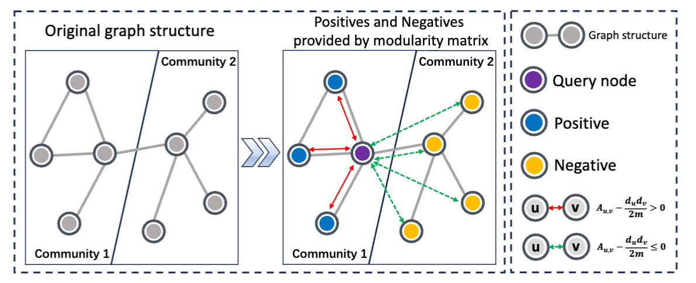
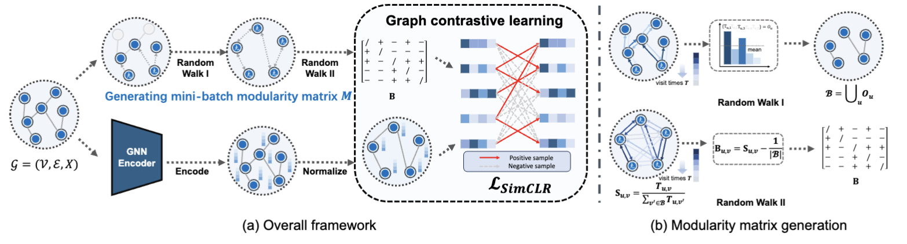

<div align="center">
<h1> 🎩 MAGI (CoMmunity-Aware Graph clusterIng)</h1>
<h3>Revisiting Modularity Maximization for Graph Clustering: A Contrastive Learning Perspective</h3>


arXiv ([arXiv:2406.142886](https://arxiv.org/abs/2406.142886)),

</div>

<div align="center">
  
</div>

#### TL; DR
* **(Modularity maximization == contrastive learning)** We establish the connection between *modularity maximization* and *graph contrastive learning*
* **(MAGI framework)** We propose MAGI, a community-aware graph contrastive learning framework that uses modularity maximization as its pretext task
* **(Performance and scalibility)** MAGI has achieved state-of-the-art performance in graph clustering and demonstrates excellent scalability on industrial-scale graphs


# Requirements
> [!NOTE]
> Higher versions should be also compatible.

* PyTorch
* PyTorch Geometric
* PyTorch Cluster
* PyTorch Scatter
* PyTorch Sparse
* Scipy
* Scikit-learn
* Scikit-learn-intelex
* Ogb

```bash
pip install -r requirements.txt
```

# Model


# Reproduction

* Cora
  ```
  python ./train_gcn.py --verbose True --log True --log_file './log/cora/' --times 10 --dataset 'Cora' --hidden '512' --wt 100 --wl 2 --tau 0.3 --ns 0.5 --lr 0.0005 --epochs 400 --wd 1e-3
  ```
* CiteSeer
  ```
  python ./train_gcn.py --verbose True --log False --log_file './log/citeseer/' --times 10 --dataset 'Citeseer' --hidden '1024,512' --wt 100 --wl 3 --tau 0.9 --ns 0.5 --lr 0.0001 --epochs 400 --wd 5e-4
  ```
* Amazon-photo
  ```
  python ./train_gcn.py --verbose True --log True --log_file './log/photo/' --times 10 --dataset 'Photo' --hidden '512' --wt 100 --wl 3 --tau 0.5 --ns 0.5 --lr 0.0005 --epochs 400 --wd 1e-3
  ```
* Amazon-computers
  ```
  python ./train_gcn.py --verbose True --log True --log_file './log/computers/' --times 10 --dataset 'Computers' --hidden '1024,512' --wt 100 --wl 3 --tau 0.9 --ns 0.1 --lr 0.0005 --epochs 400 --wd 1e-3
  ```
* ogbn-arxiv
  ```
  python ./train_sage.py --verbose True --log True --log_file './log/ogbn_arxiv/' --times 1 --dataset 'ogbn-arxiv' --batchsize 2048 --max_duration 60 --kmeans_device 'cpu' --kmeans_batch -1 --hidden '1024,256' --size '10,10' --wt 20 --wl 5 --tau 0.9 --ns 0.1 --lr 0.01 --epochs 400 --wd 0 --dropout 0
  ```
* reddit
  ```
  python ./train_sage.py --verbose True --log True --log_file './log/reddit/' --times 1 --dataset 'Reddit' --batchsize 2048 --max_duration 60 --kmeans_device 'cpu' --kmeans_batch -1 --hidden '1024,256' --size '10,10' --wt 20 --wl 5 --tau 0.5 --ns 0.5 --lr 0.01 --epochs 400 --wd 0 --dropout 0
  ```
* ogbn-products
  ```
  python ./train_sage.py --verbose True --log True --log_file './log/ogbn_products/' --times 1 --dataset 'ogbn-products' --batchsize 2048 --max_duration 60 --kmeans_device 'cuda' --kmeans_batch 300000 --hidden '1024,1024,256' --size '10,10,10' --wt 20 --wl 4 --tau 0.9 --ns 0.1 --lr 0.01 --epochs 400 --wd 0 --dropout 0
  ```


