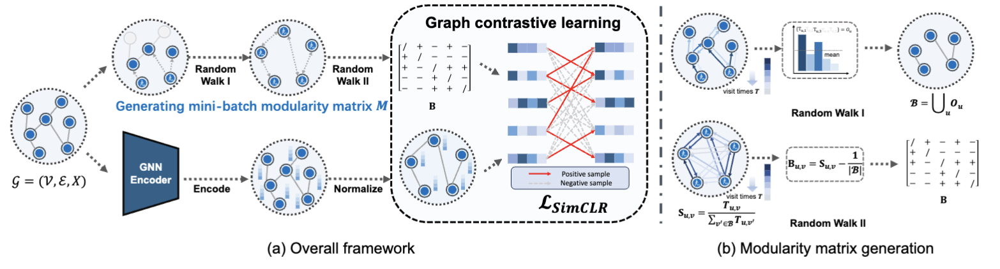

# CoMmunity-Aware Graph clusterIng (MAGI) Framework
The official PyTorch implementation of "Revisiting Modularity Maximization for Graph Clustering: A Contrastive Learning Perspective"

# Abstract
Graph clustering, a fundamental and challenging task in graph mining, aims to classify nodes in a graph into several disjoint clusters. In recent years, graph contrastive learning (GCL) has emerged as a dominant line of research in graph clustering and advances the new state-of-the-art. However, GCL-based methods heavily rely on graph augmentations and contrastive schemes, which may potentially introduce challenges such as semantic drift and scalability issues. Another promising line of research involves the adoption of modularity maximization, a popular and effective measure for community detection, as the guiding principle for clustering tasks. Despite the recent progress, the underlying mechanism of modularity maximization is still not well understood. In this work, we dig into the hidden success of modularity maximization for graph clustering. Our analysis reveals the strong connections between modularity maximization and graph contrastive learning, where positive and negative examples are naturally defined by modularity. In light of our results, we propose a community-aware graph clustering framework, coined MAGI, which leverages modularity maximization as a contrastive pretext task to effectively uncover the underlying information of communities in graphs, while avoiding the problem of semantic drift. Extensive experiments on multiple graph datasets verify the effectiveness of MAGI in terms of scalability and clustering performance compared to state-of-the-art graph clustering methods. Notably, MAGI easily scales a sufficiently large graph with 100M nodes while outperforming strong baselines.



# Requirements
* PyTorch
* PyTorch Geometric

# Installation
```bash
pip install -r requirements.txt
```

# Reproduction

* Cora
  ```
  python ./train_gcn.py --verbose True --log True --log_file './log/cora/' --times 10 --dataset 'Cora' --hidden '512' --wt 100 --wl 2 --tau 0.3 --ns 0.5 --lr 0.0005 --epochs 400 --wd 1e-3
  ```
* CiteSeer
  ```
  python ./train_gcn.py --verbose True --log False --log_file './log/citeseer/' --times 10 --dataset 'Citeseer' --hidden '1024,512' --wt 100 --wl 3 --tau 0.9 --ns 0.5 --lr 0.0001 --epochs 400 --wd 5e-4
  ```
* Amazon-photo
  ```
  python ./train_gcn.py --verbose True --log True --log_file './log/photo/' --times 10 --dataset 'Photo' --hidden '512' --wt 100 --wl 3 --tau 0.5 --ns 0.5 --lr 0.0005 --epochs 400 --wd 1e-3
  ```
* Amazon-computers
  ```
  python ./train_gcn.py --verbose True --log True --log_file './log/computers/' --times 10 --dataset 'Computers' --hidden '1024,512' --wt 100 --wl 3 --tau 0.9 --ns 0.1 --lr 0.0005 --epochs 400 --wd 1e-3
  ```
* ogbn-arxiv
  ```
  python ./train_sage.py --verbose True --log True --log_file './log/ogbn_arxiv/' --times 1 --dataset 'ogbn-arxiv' --batchsize 2048 --max_duration 60 --kmeans_device 'cpu' --kmeans_batch -1 --hidden '1024,256' --size '10,10' --wt 20 --wl 5 --tau 0.9 --ns 0.1 --lr 0.01 --epochs 400 --wd 0 --dropout 0
  ```
* reddit
  ```
  python ./train_sage.py --verbose True --log True --log_file './log/reddit/' --times 1 --dataset 'Reddit' --batchsize 2048 --max_duration 60 --kmeans_device 'cpu' --kmeans_batch -1 --hidden '1024,256' --size '10,10' --wt 20 --wl 5 --tau 0.5 --ns 0.5 --lr 0.01 --epochs 400 --wd 0 --dropout 0
  ```
* ogbn-products
  ```
  python ./train_sage.py --verbose True --log True --log_file './log/ogbn_products/' --times 1 --dataset 'ogbn-products' --batchsize 2048 --max_duration 60 --kmeans_device 'cuda' --kmeans_batch 300000 --hidden '1024,1024,256' --size '10,10,10' --wt 20 --wl 4 --tau 0.9 --ns 0.1 --lr 0.01 --epochs 400 --wd 0 --dropout 0
  ```


